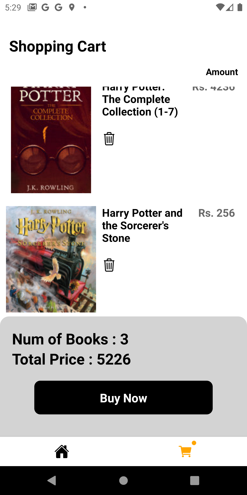

# Books-App-Assignment

This is a Books app made with React Native + Firebase Google Auth + Google Books API

## Installation

```bash
Clone This Repo To Your PC

Run npm install/yarn

Run The App
```

### Built With

- React Native
- Firebase : Google Auth Sign In/Sign Up
- Google Books API : https://www.googleapis.com/books/v1/volumes?q=harry+potter&maxResults=20

### Sample Preview


 <table>
  <tr>
     <td>Home Screen</td>
     <td>Item Page</td>
     <td>Cart Page</td>
  </tr>
  <tr>
    <td valign="top"></td>
    <td valign="top"></td>
    <td valign="top"></td>
  </tr>
 </table>
 
 
 - This project includes the use of different React Hooks, namely : useState,useEffect,useContext.
 - Icons are derived from the Ionicons pack from the react-native-vector-icons library : https://www.npmjs.com/package/react-native-vector-icons.
 - firebase/app and firebase/auth are used in the project.
 
 
 
